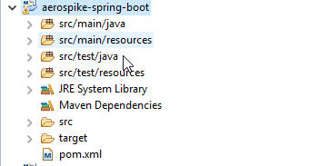

[[part-one-spring-initializer]]
= Spring Initializer using Spring Boot

The cool part about Spring Boot is it makes a lot of common sense guesses for you. Like if you add Spring Data to your build, it guesses you’re going to want a transaction manager. The transaction manager is just one example of a Spring component you’d normally need to wire up that Spring Boot will automatically do for you. Spring Boot actually has over 200 default choices which it makes for you.

Spring Boot takes a lot of the mundane pain out of building Spring Applications. It really is making Spring Fun again. Spring Boot is still a newcomer in the family of Spring Projects. Even though Spring Boot is new, I think its the future of Spring application development.

== Building a Spring Boot Web Application

To build a simple web application we are going to use the following technologies.

* The spring framework
* Spring MVC for the web part.
* http://www.thymeleaf.org/[Thymeleaf] for the template engine
* Aerospike for the persistence layer
* Spring Data to make persistence easier with Aerospike
* Tomcat as your application server

In this Spring Boot tutorial I’m going to walk you through step by step in developing a web application using Spring Boot and the technologies I listed above.

== Getting Started with Spring Boot

=== Creating the Spring Boot Project Using Eclipse

Start up eclipse and create a new Maven project. Select Create a simple project and when asked for Maven configuration select Group Id of "org.aerospike" with artifact Id of "aerospike-spring-boot", select Finnish

==== pom.xml

Here is the Maven POM file you should create. This was customized for us based on the options we selected in the Spring Initializer. The presence of these dependencies is important because Spring Boot will make decisions on what to create automatically when certain things are found on the classpath. 

[source,xml]
----
<?xml version="1.0" encoding="UTF-8"?>
<project xmlns="http://maven.apache.org/POM/4.0.0" xmlns:xsi="http://www.w3.org/2001/XMLSchema-instance"
	xsi:schemaLocation="http://maven.apache.org/POM/4.0.0 http://maven.apache.org/xsd/maven-4.0.0.xsd">

	<modelVersion>4.0.0</modelVersion>
	<groupId>org.aerospike</groupId>
	<artifactId>aerospike-spring-boot</artifactId>
	<version>0.0.1-SNAPSHOT</version>

	<parent>
		<groupId>org.springframework.boot</groupId>
		<artifactId>spring-boot-starter-parent</artifactId>
		<version>1.2.5.RELEASE</version>
	</parent>

	<dependencies>
		<dependency>
			<groupId>org.springframework.boot</groupId>
			<artifactId>spring-boot-starter-security</artifactId>
		</dependency>
		<dependency>
			<groupId>org.springframework.boot</groupId>
			<artifactId>spring-boot-starter-thymeleaf</artifactId>
		</dependency>
		<dependency>
			<groupId>org.springframework.boot</groupId>
			<artifactId>spring-boot-starter-web</artifactId>
		</dependency>
		<dependency>
			<groupId>org.springframework.boot</groupId>
			<artifactId>spring-boot-starter-data-aerospike</artifactId>
			<version>0.0.1-SNAPSHOT</version>		
		</dependency>
		<dependency>
			<groupId>org.springframework.boot</groupId>
			<artifactId>spring-boot-starter-test</artifactId>
			<scope>test</scope>
		</dependency>
				<dependency>
			<groupId>org.springframework.data</groupId>
			<artifactId>spring-data-commons</artifactId>
			<version>1.11.0.RELEASE</version>
		</dependency>
	</dependencies>

	<properties>
		<java.version>1.8</java.version>
	</properties>

	<build>
		<plugins>
			<plugin>
				<groupId>org.springframework.boot</groupId>
				<artifactId>spring-boot-maven-plugin</artifactId>
			</plugin>
		</plugins>
	</build>

	<repositories>
		<repository>
			<id>spring-milestone</id>
			<url>https://repo.spring.io/libs-release</url>
		</repository>
	</repositories>

	<pluginRepositories>
		<pluginRepository>
			<id>spring-milestone</id>
			<url>https://repo.spring.io/libs-release</url>
		</pluginRepository>
	</pluginRepositories>

</project>
----

==== SpringBooWebApplication.java

Create us a very basic Spring Boot application class. Technically, this is a Spring Configuration class. The annotation @SpringBootApplication enables the Spring Context and all the startup magic of Spring Boot.

[source,java]
----
package aerospike.springboot;

import org.springframework.boot.SpringApplication;
import org.springframework.boot.autoconfigure.SpringBootApplication;

@SpringBootApplication
public class SpringBootWebApplication {
 
    public static void main(String[] args) {
        SpringApplication.run(SpringBootWebApplication.class, args);
    }
}
----

==== SpringBootWebApplicationTests.java

We’re also give a stub of a JUnit Integration test. 

[source,java]
----
package aerospike.springboot;

import org.junit.Test;
import org.junit.runner.RunWith;
import org.springframework.test.context.web.WebAppConfiguration;
import org.springframework.boot.test.SpringApplicationConfiguration;
import org.springframework.test.context.junit4.SpringJUnit4ClassRunner;

@RunWith(SpringJUnit4ClassRunner.class)
@SpringApplicationConfiguration(classes = SpringBootWebApplication.class)
@WebAppConfiguration
public class SpringBootWebApplicationTests {

	@Test
	public void contextLoads() {
	}

}

----

--- Conclusion

In this section we've taken a look on using maven with Spring boot inside an eclipse application
