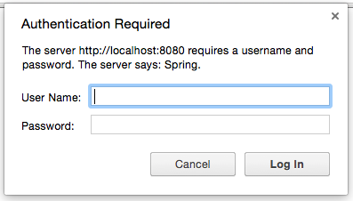
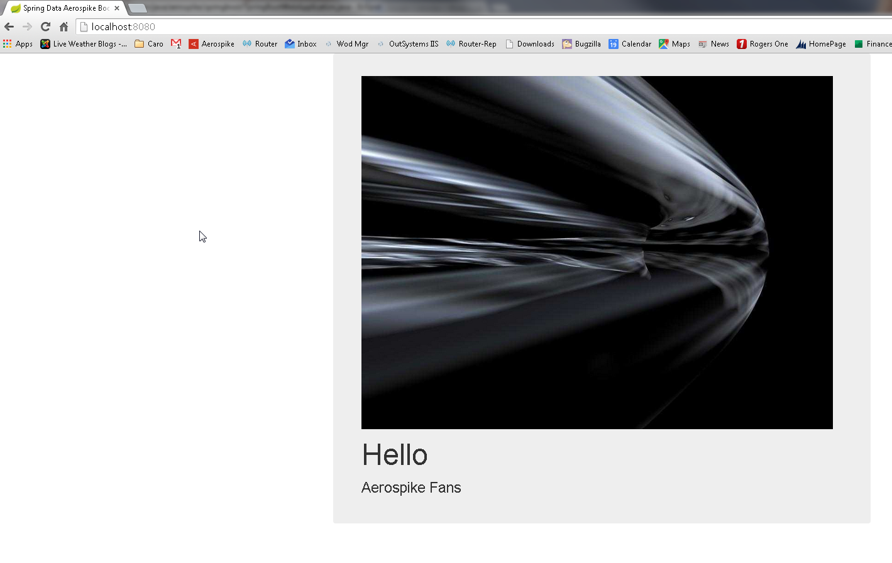

[[part-two-using-thymeleaf]]
= Spring Boot Web Application - using ThymeLeaf

In this post I am going to walk you through enabling rendering a webpage using Thymeleaf and Spring MVC.

== Why Thymeleaf?

Traditionally, Spring MVC applications used Java Server Pages, or JSPs to generate html content. JSPs are a mature technology and has been around since the early days of Java. In terms of raw speed, JSPs are hard to beat too. But when you do not need the absolute raw speed of a JSP, you may want to consider alternatives to JSPs which help improve developer productivity.

JSPs offer an HTML ‘like’ syntax. Meaning its close, but not completely compatible with HTML. Thymeleaf on the other hand, aims to be a “Natural Template”. This means the Thymeleaf template file will open and display normally in a browser, while a JSP file does not.

== Thymeleaf Configuration and Spring Boot

If you were using just Spring MVC, you would need to configure the Thymeleaf template engine for use. But not so when you’re using Spring Boot. Because we’ve included the dependency spring-boot-starter-thymeleaf in our Maven POM for the project, Spring Boot will do some things automatically for us.

By default, Spring Boot configures the Thymeleaf template engine to read template files from
[source]
----
/resources/templates
----
Effectively, you as the developer just need to start making Thymeleaf templates and dropping them into
[source]
--
/resources/templates
--
== Thymeleaf Template

Let’s start with a very basic HTML file to show.

=== Thymeleaf Template – index.html
[source,xml]
----
<!DOCTYPE html>  							//<1>
<html xmlns:th="http://www.thymeleaf.org">  //<2>
<head lang="en">
    <title>Spring Data Aerospike Boot</title>
    <meta http-equiv="Content-Type" content="text/html; charset=UTF-8"/> //<3>
</head>
<body>
	<h1>Hello</h1>
    <h2>Aerospike Fans</h2>
</body>
</html>
----
<1> Is the standard declaration for HTML 5
<2> sets a XML Namespace for Thymeleaf. This is important as you start to use the Thymeleaf extensions.
<3> Defines the character set for the HTML file.

== Spring MVC Controller

The next step we need to take care of is creating a Spring MVC controller. Because we’ve included the dependency spring-boot-starter-web, Spring Boot automatically configured Spring MVC for us. We also get an embedded instance of Tomcat to run our application in too. This may sound simple, but it does take care of a lot of setup tasks that we would normally need to do if we were using Spring MVC without Spring Boot.

With using Spring Boot, we only need to define our controller class. Nothing else. Like other things Spring Boot sets up sensible defaults for us.

[source]
--
IndexController.java
--

At this point, we just need a very simple controller. We want to map the web root path (“/”) to the index template. A common convention used in Spring MVC is to return the string name of the template file, less the file extension. Thus to show the index.html file we defined above, our controller method needs to return the string ‘index’,

[source,java]
----
package aerospike.springboot.controllers;

import org.springframework.stereotype.Controller;
import org.springframework.web.bind.annotation.RequestMapping;

@Controller //<1>
public class IndexController {
 
    @RequestMapping("/") //<2>
    String index(){ 
        return "index";
    }
}
----
<1>  I’ve used the *@Controller* annotation to make this class a Spring component and a Spring MVC controller.
<2>  I annotated the index()  method with a *@RequestMapping*  annotation. By doing this, I’ve configured the root path to this controller method.

== Running the Example

Goto the class SpringBootWebApplication  and right click on the main()  method, then click on run.  This will run the Spring Boot application. Spring Boot will startup an embedded instance of Tomcat and deploy our application to it.

BUT – if you navigate to http://localhost:8080 via your browser, the port Tomcat is listening on, you will see this

So, what’s happening here? Because we added Spring Security into our build, Spring Boot has configured Spring Security for our use. The default behavior is to require basic auth for all endpoints. This is a good approach to secure everything by default, but it can trip you up if you’re not accustomed to working with Spring Security.

== Spring Security Configuration

To accommodate the Spring Security configuration, I created a new package and added the SecurityConfiguration  class. By annotating the class with the *@Configuration*  annotation, I’m telling Spring this is a configuration class. When doing Java configuration for Spring Security, you need to extend the WebSecurityConfigurerAdapater  class and override the configure method.

[source,java]
----
package aerospike.springboot.configuration;

import org.springframework.context.annotation.Configuration;
import org.springframework.security.config.annotation.web.builders.HttpSecurity;
import org.springframework.security.config.annotation.web.configuration.WebSecurityConfigurerAdapter;

@Configuration
public class SecurityConfiguration extends WebSecurityConfigurerAdapter {

	@Override
	protected void configure(HttpSecurity httpSecurity) throws Exception {
		httpSecurity.authorizeRequests().antMatchers("/").permitAll();
	}
}
----

== Spring Boot and Package Scans

One quick note I want to call out here, the controller and configuration classes I’ve just defined are annotated Spring Components. Spring will only pick these up when their respective package is included in a component scan. A default behavior of Spring Boot when using the *@SpringBootApplication* annotation is to perform a package scan on its package (and all sub packages). Because my Spring Boot application resides in the package aerospike.springboot, the annotated Spring Components in the child packages are automatically found by Spring. If they were in a different package tree, I would need to explicitly tell Spring Boot to scan that package. This is important to know, and is something that could easily trip up a beginner with Spring Boot.

=== Example Page

At this point in building our Spring Boot web application, we have not applied any styling to our Thymeleaf template file. Its pure simple, unstyled HTML.

== Managing Web Resources Under Spring Boot

At this point our Spring Boot Web application is working, in the sense it generate some HTML. But that’s not very realistic for today’s web applications. Any modern web application is going to have some web resources to manage. Web resources typically include:
* CSS Files
* Javascript assets
* images

Right now, our web page is very boring. Lets dress it up using Bootstrap CSS and JQuery.

== Static Resources with Spring Boot

Spring Boot will automatically serve static resources from the path /resources/static. By a generally accepted convention, you will typically put CSS files in /resources/static/css, Javascript files in /resources/static/js, and images in resources/static/images. You could name the directories after /resources/static/ whatever you wish, this is just a convention you will likely see used and it helps you organize the static resources.

I like to add a CSS file for any overrides and customization I’ll need. I’m going to add an empty CSS file into /resources/static/css and then add it to the Thymeleaf template as follows:

[source,xml]
----
<link href="../static/css/aerospike.css"
          th:href="@{css/aerospike.css}" rel="stylesheet" media="screen"/>          
----

Notice how the link tag has two href attributes? The first one in normal HTML will be used by the browser when the template is read from the file system. The second with the ‘th’ namespace is used by Thymeleaf when the template is rendered via Spring Boot. In this case a SPeL expression is being used to resolve the path of the static asset under Spring Boot, and this will be used as the path when the template is rendered by Spring Boot for the browser via a request through Tomcat.

This is what is meant when Thymeleaf is called a natural template engine. In this case, the CSS file is found for the HTML file via the relative path in the file system, then again when it’s deployed using a SPeL notation.

== Spring Boot and WebJars

More than once I’ve copied all the files for Bootstrap CSS or JQuery into a resources folder, and then managed the lifecycle of their versions. This can be a manual and tedious process. WebJars is a very cool concept which which packages web assets into a JAR file for your use. The JAR s are available in public Maven repositories, making them build assets you can easily include in your project. (Did you know JAR files are just zip files, with the extension changed to JAR?)

Spring Boot supports WebJars out of the box. We just need to include the dependency in our Maven POM file for the project, then add it to our Thymeleaf template file.

We can declare the WebJar dependencies for Bootstrap CSS and JQuery by adding the following lines to our Maven POM file:

[source,xml]
----
		<!--WebJars-->
		<dependency>
			<groupId>org.webjars</groupId>
			<artifactId>bootstrap</artifactId>
			<version>3.3.4</version>
		</dependency>
		<dependency>
			<groupId>org.webjars</groupId>
			<artifactId>jquery</artifactId>
			<version>2.1.4</version>
		</dependency>
----

Now we can add the Bootstrap CSS and JQuery dependencies to our index.html file as follows:
[source,xml]
----
<!DOCTYPE html>
<html xmlns:th="http://www.thymeleaf.org">
<head lang="en">

    <title>Spring Data Aerospike Boot</title>
    <meta http-equiv="Content-Type" content="text/html; charset=UTF-8"/>
    
        <meta http-equiv="Content-Type" content="text/html; charset=UTF-8"/>

    <link href="http://cdn.jsdelivr.net/webjars/bootstrap/3.3.4/css/bootstrap.min.css"
          th:href="@{/webjars/bootstrap/3.3.4/css/bootstrap.min.css}"
          rel="stylesheet" media="screen" />

    

    <link href="../static/css/aerospike.css"
          th:href="@{css/aerospike.css}" rel="stylesheet" media="screen"/>
</head>
----

Note: In this example I’m using a public CDN for the Bootstrap CSS and JQuery assets. By doing this I can preserve the natural templating of the Thymeleaf template file.

== Styling Our Example

Now that we have the Bootstrap CSS and JQuery resources loading with our Spring Boot web application, lets add a little Bootstrap styling to our index.html file.

[source]
--
index.html
--

[source,xml]
----
<!DOCTYPE html>
<html xmlns:th="http://www.thymeleaf.org">
<head lang="en">

    <title>Spring Data Aerospike Boot</title>
    <meta http-equiv="Content-Type" content="text/html; charset=UTF-8"/>
    
        <meta http-equiv="Content-Type" content="text/html; charset=UTF-8"/>

    <link href="http://cdn.jsdelivr.net/webjars/bootstrap/3.3.4/css/bootstrap.min.css"
          th:href="@{/webjars/bootstrap/3.3.4/css/bootstrap.min.css}"
          rel="stylesheet" media="screen" />

    

    <link href="../static/css/aerospike.css"
          th:href="@{css/aerospike.css}" rel="stylesheet" media="screen"/>
</head>
<body>

    

        
        <h1>Hello</h1>
 
        <h2>Aerospike Fans</h2>
    

 
</body>
</html>
----

== Example Page

== Conclusion

At this point in this tutorial series on building a Spring Boot web application using Spring Boot, we’ve shown you how to create a basic project using the Spring Initializr and setup support for Thymeleaf. You can see how Spring Boot has made some common sense choices for us, like configuring the Thymeleaf template engine for use with Spring MVC, defaulting the locations for static resources, and providing out of the box support for WebJars.
